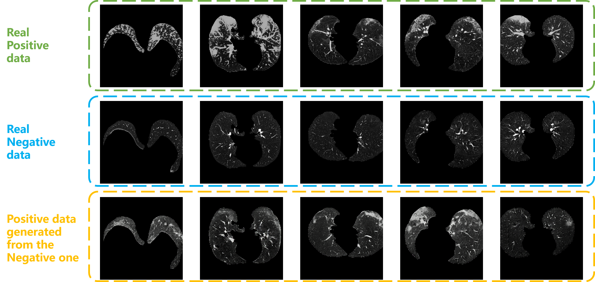
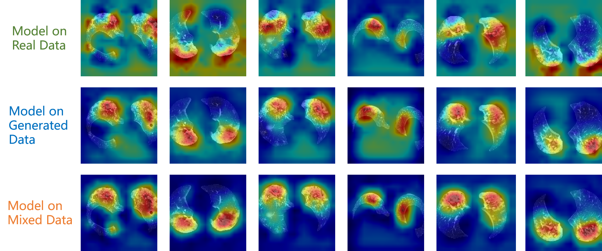

# Synthesis-of-COVID-19-CT-Scan
We built a generation model to synthesize the corresponding COVID-19 infection CT scan from a non-COVID CT.

To mitigate the absence of sufficient public COVID-19 data, a generation model to synthesize the corresponding COVID-19 infection CT scan from a non-COVID CT is presented here. 

In this work, the public COVID-19 CT data provided by [covid-chestxray-dataset](https://github.com/ieee8023/covid-chestxray-dataset) are employed to train the a generation model.

## Generation Results

## Verifaction with CAM
A classification model with ResNet-18 are trained on the COVID-19 data and LUNA16 data, and then CAM（Class Activation Map）is employed to visualize the CNN feature activation. By mixing the real COVID-19 data and the generated ones, the performance of CAM has been modified.

